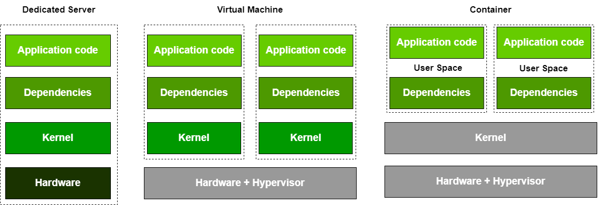
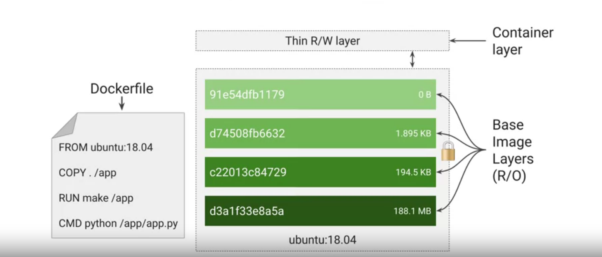

# Container與Kubernetes(k8s) 介紹
    若要了解Container帶來的好處，就要先了解Container的歷史演進
    以下則會分幾個部分介紹
    - [Container演進](##過去如何部署apps?)
    - [Container images](## Container images)

## 過去如何部署apps?

1. 部署在特定的Server上
    - 自行準備硬體設施、作業系統、網路連結、軟體相關套件、apps本身程式碼
    - 如果需要更多的運算資源，多加幾台電腦
    - 問題：**花費時間與精力，通常部署可能會花到幾個月且無法難以利用與維護**

2. Virtual Machine(VM)
    - 虛擬化技術則可以使單一的實體電腦能執行不同的虛擬伺服器與作業系統
    - Hypervisor：用以允許不同的VM共享同樣的硬體
    - 採用虛擬化技術讓我們 **花費更少時間部署，且更容易複製，因為VM可以被映像化**
    - 問題：**然而該app的所有相依套件仍然綁在一起，並且不太容易從一台虛擬機器或一個hypervisor的產品遷移到另外一個**
    - 問題：**如果在該VM上運行許多的app，這些app共有的相依套件並沒有被分隔開來，在更新或版本上會彼此影響**
    - VM-Centric ways：或許可以透過一個app有個專門的VM來執行，但在Scalability上非常沒有效率，以kernel的更新來講，專門的VM變便得難以維護且浪費時間資源

3. Container
    - Container 透過將User spaces分離出來，只用以執行app的程式
    - Container 不像VM裝了整個的作業系統，且不用重啟整個作業系統來BOOT UP VM

下圖為特定server、VM與Container架構比較

## Container images

1. Container 運用的科技
    - Linux process
        - 每一個Linux Process有自己的虛擬記憶體位址空間與其他位址區隔開來，並且可以快速創造與銷毀
    - Linux namespaces
        - 控制一個app可以看到的：process ID、ip addresses等等
    - cgroups
        - 控制一個app可以使用的資源：CPU、記憶體等等        
    - Union File System
        - 封裝apps，並將會用到的相依套件封裝成一組數層的結構，也就是images

2. Container images
    在製作images中，使用者會需要定義一個dockerfile的檔案，每一個dockerfile的指令會形成images中的一層layer，且該layer是唯讀(read-only)屬性，如下圖：

    

    左圖dockerfile的每一行指令會為右方的images製造一層layer，images最上方的Container layer則提供讓使用者寫入新資訊等各種調整動作。
    - 當更新images的時候，Container僅會重新製作和之前有差異的layer

